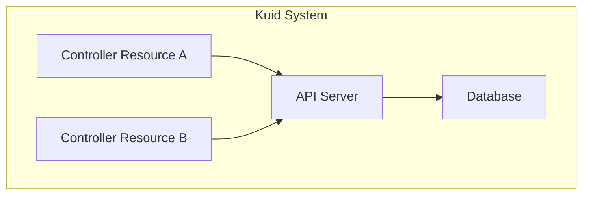

`Kuid` is a native Kubernetes tool designed for managing infrastructure resources. Leveraging Kubernetes-native architecture and customizable fields, `Kuid` serves as a cornerstone for automation by facilitating streamlined resource organization and tracking. Notable features include robust IP Address Management (IPAM) capabilities, enabling efficient allocation and oversight of IP resources. Additionally, Kuid offers sophisticated infrastructure management functionalities, empowering users to organize and manage various infrastructure components within a structured hierarchy. With seamless integration into automation workflows, Kuid emerges as a key building block for driving efficiency and scalability in automating your infrastructure

## Architecture

Every resource supported by `Kuid` is implemented as an API resource within Kubernetes, harnessing the full potential of Kubernetes' event-driven API architecture. This design choice ensures seamless integration with Kubernetes tooling, enabling smooth interoperability and leveraging the powerful ecosystem surrounding Kubernetes

## Features

All resources are modelled as native KRM resources in kubernetes which allows to hierarchically manage resources.

Resources:

- Region, sites
- Racks, Nodes, Links
- IPAM
- ASN
- VLAN
- Extended Communities
- GeneralID
- DNS plugin

## Join us

Have questions, ideas, bug reports or just want to chat? Come join [our discord server](todo).

