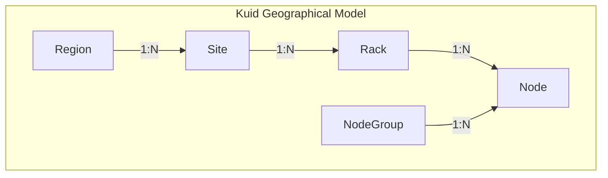
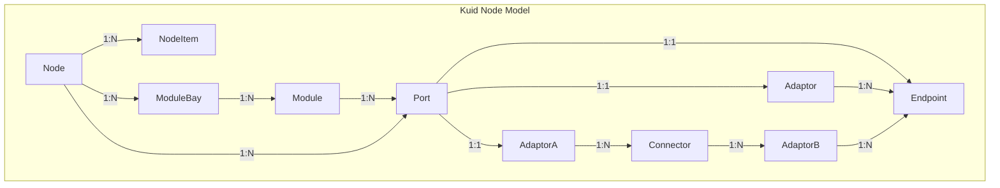
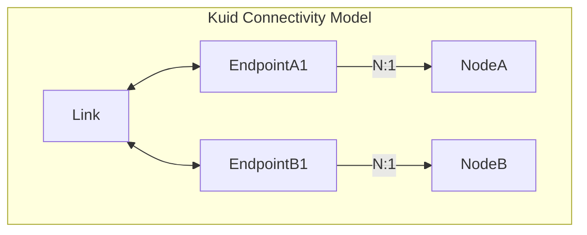

# Inventory 

Within the realm of infrastructure management, `Kuid` excels as a powerful tool for inventory resource management. By offering a comprehensive solution for capturing resources across physical, virtual, and containerized environments, `Kuid` enables users to gain unparalleled visibility into their infrastructure assets. From servers and virtual machines to containers and beyond, `Kuid` facilitates the seamless tracking and management of diverse resources within the infrastructure landscape.

## Geographical model

The geographical model in `Kuid` follows a hierarchical structure to organize infrastructure resources efficiently. At the highest level, we have the concept of a `Region`. A `Region` represents a broad geographical area where infrastructure resources are deployed. Within each `Region`, there can be multiple `Sites`. Each `Site` corresponds to a specific physical or logical location within the `Region`, such as a data center, colo or a cloud region.

Within each `Site`, resources are further organized into `Racks`. A `Rack` represents a physical rack used to house hardware components, such as servers, switches, and storage devices. Multiple `Racks` can exist within a single `Site`, depending on the size and capacity of the location. A rack is an optional identifier

At the lowest level of the hierarchy, we have individual `Nodes`. `Nodes` are the fundamental units of compute, storage, or networking resources within the infrastructure. These `Nodes` are typically deployed within `Racks` and are responsible for executing applications, storing data, and facilitating network communication.

Additionally, each `Node` may belong to a specific `NodeGroup`. A `NodeGroup` represents a logical grouping of `Nodes` that are managed by a single administrative entity or organization. This allows for centralized management and control of infrastructure resources within a defined administrative boundary. A `NodeGroup` in `kuid` is an abstract grouping. E.g. A `NodeGroup` on one hand, can be used to represent a topology that spans multiple sites and regions, but a `NodeGroup` can also be used to group all nodes of a cluster together.

The relationships between these entities are hierarchical, with each level containing multiple instances of the level below it. For example, a `Region` may contain multiple `Sites`, each `Site` may contain multiple `Racks`, and each `Rack` may contain multiple `Nodes`. This hierarchical organization enables efficient management and scaling of infrastructure resources within `Kuid`, ensuring optimal performance and resource utilization across different geographical locations.

Overall, the geographical model in Kuid provides a structured framework for organizing and managing infrastructure resources, allowing users to efficiently deploy, monitor, and maintain their infrastructure deployments across diverse geographical regions.

## Node model

The `Node` model in Kuid encompasses a hierarchical structure of components essential for infrastructure management. At the core of the model is the `Node`, representing individual units of compute, storage, or networking resources within the infrastructure. Nodes are composed of various `NodeItems`, which may include hardware components such as FANs, PowerUnits, CPUs, memory modules, storage disks, and network interfaces. Additionally, `Nodes` can be equipped with `ModuleBays`, providing slots for modular hardware components known as `Modules`. `Modules` can further extend the capabilities of Nodes and may include specialized hardware for specific tasks. Each Module may contain multiple `Ports`, representing endpoints for communication with external systems or networks. Ports that allow pluggable modules an adaptor can be attached to a port to represent a breakout capability which can attach to multiple endpoints. This hierarchical arrangement allows for flexible configuration and expansion of `Nodes`, enabling users to customize and optimize infrastructure resources according to their specific requirements and workloads.

!!!note "We've opted for the name `node` instead of `device` as it better encompasses the scope we aim to cover. While 'device' often implies a physical entity, we intend to model both physical and virtual, including containerized entities within our system"

!!!note "A `node` equipped with a set of `endpoints` resources might suffice as resources to model a fixed format entity. Conversely, modular systems often require the use of additional resources such as `NodeItems` and `ModuleBays`/`Module(s)` to accommodate their flexible configurations."

## Connectivity model

The connectivity model in `Kuid` illustrates the communication pathways between `Nodes` within the infrastructure. Each `Node`, represented by `NodeA` and `NodeB`, is equipped with one or more communication interfaces, known as `Connectors`. These `Connectors` serve as connection points for external communication with other Nodes or network devices.

In the diagram, `EndpointA1` and `EndpointB1` represent the communication interfaces of `NodeA` and `NodeB`, respectively. These Connectors are connected to each other via `Links`, which represent the physical or logical connections between Nodes. The `Link` acts as a conduit for data transmission between the Connectors, facilitating the exchange of information and messages between Nodes.

Overall, the connectivity model in Kuid provides a structured framework for establishing and managing communication between Nodes, facilitating efficient data exchange and collaboration within the infrastructure environment.

!!!note "We've opted for the name `endpoint` instead of `interface` as it better encompasses the scope we aim to cover. While 'interface' is often used in networking we opted for a more neutral term that can be used in different environments"

!!!note "A `node` equipped with a set of `endpoints` resources might suffice as resources to model a fixed format entity. Conversely, modular systems often require the use of additional resources such as `NodeItems` and `ModuleBays`/`Module(s)` to accommodate their flexible configurations."
