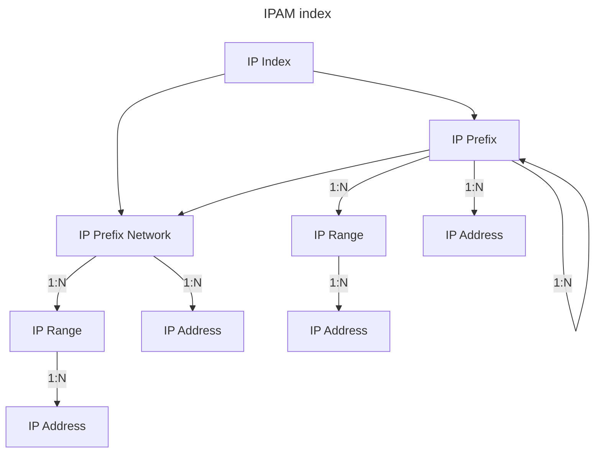

# IPAM 

Kuid implements a robust IPAM system that supports both IPv4 and IPv6 addresses. It utilizes multiple routing tables or indices to enable Virtual Routing and Forwarding (VRF) and manage environments with overlapping IP address spaces.

## IP Index

An `IPIndex` in Kuid acts as a container for both IPv4 and IPv6 addresses, offering flexible management by associating with specific teams, VRFs, or other entities. This organizational structure allows for fine-grained control and segmentation of IP resources across various contexts.

The `IPIndex` supports hierarchical definitions, including IP Prefixes, Ranges, and/or Addresses, which allows for scalable and organized management of IP resources.

## IP Prefix

An IP Prefix represents a range of IP addresses registered within the IP Index. These prefixes can be nested according to CIDR notation, allowing for efficient address allocation and management. Kuid supports two types of IP prefixes:

- Network Prefixes: Used for devices with physical/virtual nics. Network based prefixes pre-allocated network and broadcast addresses of the prefix in the ipam backend (with the exception of IPv4 /31 and IPv6 /127 prefixes).
- Regular Prefixes: Used for IP prefix hierarchies, IP Pools, etc. Regular prefixes do not allocate the network or broadcast addresses in the ipam backend, providing more flexibility for custom address management.

## IP Range

An IP Range defines a continuous block of IP addresses within an IP Prefix, allowing for efficient assignment and management of IP addresses within a defined range. This is useful for allocating addresses to devices or services within a specific scope while maintaining control over address distribution.

## IP Address

An IP Address refers to a specific individual address within an IP Range or Prefix, assigned to a particular resource or endpoint. The system ensures that each address is unique within its assigned context and can be dynamically or statically allocated as needed

The below diagram show the hierarchy in which IP resources are managed.

IPAM resources are stored persistently, and upon system restart or reboot, all resources are automatically restored.
