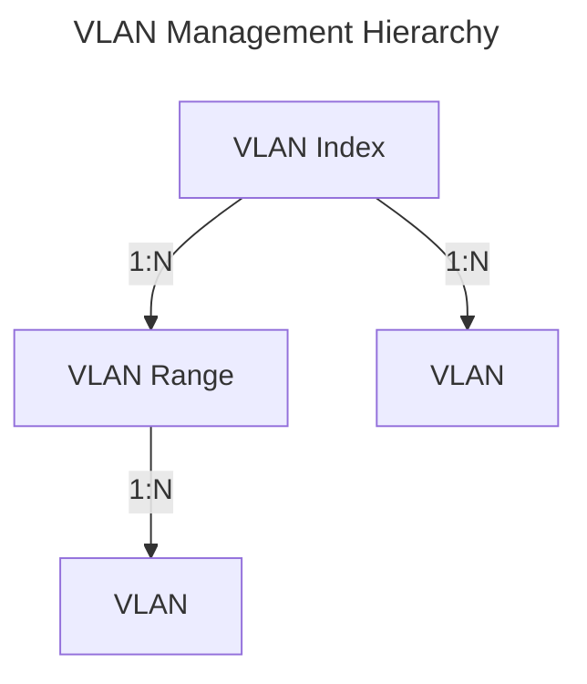

# VLAN

Kuid implements VLAN management according to IEEE 802.1Q and related standards, ensuring adherence to industry best practices.

## VLAN Index

A VLAN Index serves as a container for VLANs, defining a specific scope for their management. Each VLAN Index can be associated with a site, rack, interface, or similar entity, providing clarity on its intended scope. Within a VLAN Index, a designated minimum and maximum VLAN ID are defined, typically set to the standard values of 1 and 4094, respectively.

Each VLAN within an index must possess a unique ID and name, facilitating clear identification and organization. 

## VLAN Range

To enable more granular VLAN management, Kuid supports the subdivision of VLAN Indexes into ranges. This feature enhances the flexibility and scalability of VLAN configurations, accommodating diverse network environments and requirements.

## VLAN

In Kuid, VLANs are modeled in accordance with IEEE 802.1Q standards, utilizing a 12-bit VLAN ID and associated name. Additionally, each VLAN is endowed with an operational status (implemented using conditions), ensuring visibility into its current state and functionality. VLANs are logically organized within VLAN Indexes and may optionally be assigned to specific VLAN ranges, further enhancing the flexibility and organization of network configurations.

The below diagram show the hierarchy in which VLAN IDs are managed.

