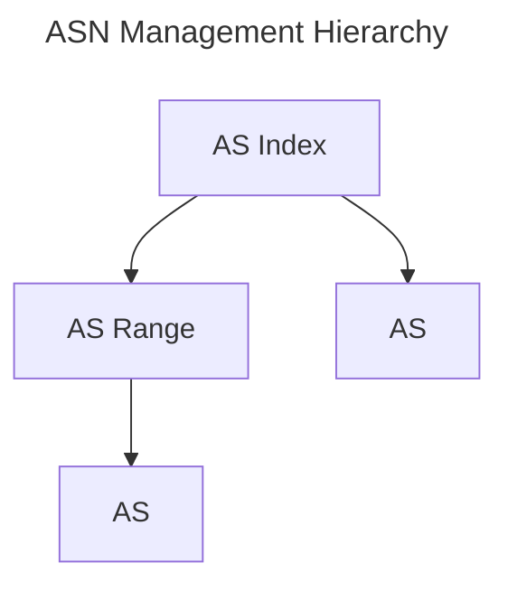

# ASN

The Autonomous System (AS) serves as a fundamental component underpinning the Internet, particularly in the context of the Border Gateway Protocol (BGP). Kuid provides robust support for managing Autonomous System Numbers (ASNs) using both 32-bit and 64-bit identifiers.

## AS Index

A AS Index serves as a container for ASNs, defining a specific scope for their management. Each AS Index can be associated with an environment, providing clarity on its intended scope. Within a AS Index, a designated minimum and maximum ASN ID can be defined.

Each ASN within an index must possess a unique ID and name, facilitating clear identification. 

## AS Range

To enable more granular ASN management, Kuid supports the subdivision of AS Indexes into ranges. This feature enhances the flexibility and scalability of AS configurations, accommodating diverse network environments and requirements.

## AS

In Kuid, ASNs are modeled as 32 or 64-bit identifiers. Additionally, each AS is endowed with an operational status (implemented using conditions), ensuring visibility into its current state and functionality. ASNs are logically organized within AS Indexes and may optionally be assigned to specific AS range, further enhancing the flexibility and organization of network configurations.

The below diagram show the hierarchy in which ASN identifiers are managed.

