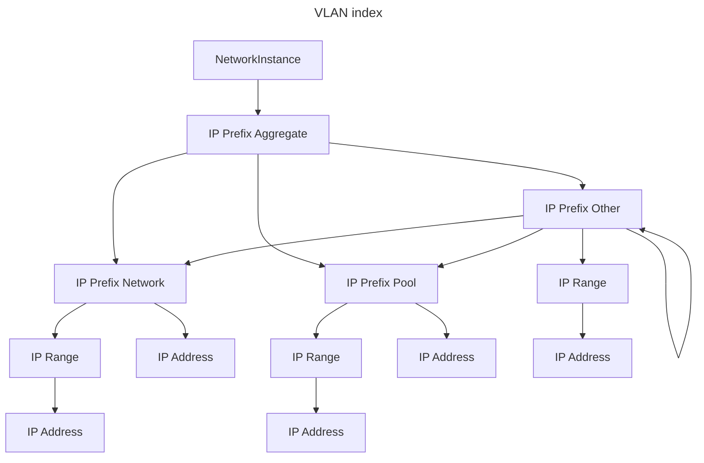

# IPAM resource

The IP Address Management (IPAM) system comprises of multiple network instances, each housing nested prefixes to facilitate collaboration across teams and environments while maintaining a clear overview of IP usage. Each NetworkInstance manages IP resources, including IP prefixes and ranges, with the top prefix termed as an aggregated prefix. IP resources can be claimed statically or dynamically within a NetworkInstance, utilizing specified or unspecified IP addresses/prefixes. Overlapping IP resources are managed effectively by instantiating multiple network instances. IP resources are further subdivided using IP Prefixes and IP Ranges, with management facilitated through VLANClaim CRD. The system supports various IPClaim types, including static and dynamic allocations for prefixes, addresses, and ranges."

IPCLAIM types:
- static IP Prefix
- static IP Address
- static IP Range
- dynamic IP Prefix
- static IP Prefix

The below diagram show the hierarchy in which ip resources are managed.

The IPAM resources are managed in a persistent storage and upon restart or reboot of the system the resources are restored.