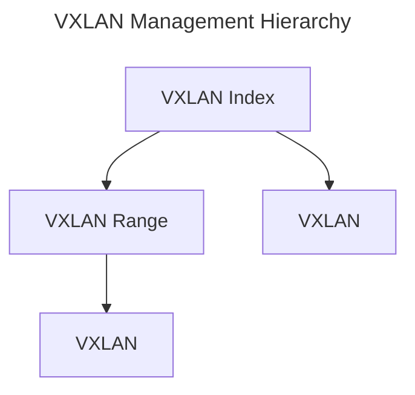

# VXLAN

Kuid implements VXLAN management according to [RFC7348](https://datatracker.ietf.org/doc/html/rfc7348), ensuring adherence to industry best practices.

## VXLAN Index

A VXLAN Index serves as a container for VXLANs, defining a specific scope for their management. Each VXLAN Index can be associated with an environment, providing clarity on its intended scope. Within a VXLAN Index, a designated minimum and maximum VXLAN ID can be defined.

Each VXLAN within an index must possess a unique ID and name, facilitating clear identification. 

## VXLAN Range

To enable more granular VXLAN management, Kuid supports the subdivision of VXLAN Indexes into ranges. This feature enhances the flexibility and scalability of VXLAN configurations, accommodating diverse network environments and requirements.

## VXLAN

In Kuid, VXLANs are modeled in accordance with [RFC7348](https://datatracker.ietf.org/doc/html/rfc7348), utilizing a 24-bit VNID and associated name. Additionally, each VXLAN is endowed with an operational status (implemented using conditions), ensuring visibility into its current state and functionality. VXLANs are logically organized within VXLAN Indexes and may optionally be assigned to specific VXLAN range, further enhancing the flexibility and organization of network configurations.

The below diagram show the hierarchy in which VXLAN VNIDs are managed.

