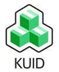

# Community

Join us in this jurney to build a Kubernetes native network resource management framework. We are happy to help and
would like to learn your user stories in our [discord server](https://discord.gg/hXt4sfUs6V).

KUID was started and currently maintained by Nokia with the clear target to make the project community driven.

## Kubenet

If you are intrested in a biger picture about how do we imagine network manegement in a Kubernetes native way check out
[Kubenet](https://learn.kubenet.dev/). 

## Logos

Logos of KUID in different formats:

* [With name 100x123 png](../assets/logos/KUID-logo-100x123.png)
* [With name 503x690 png](../assets/logos/KUID-transparent-withname-503x690.png)
* [Without name 100x100 png](../assets/logos/KUID-transparent-square-noname-100x100.png)
* [With name svg](../assets/logos/KUID-logo.svg)
* [Without name svg](../assets/logos/KUID-logo-square.svg)

---
