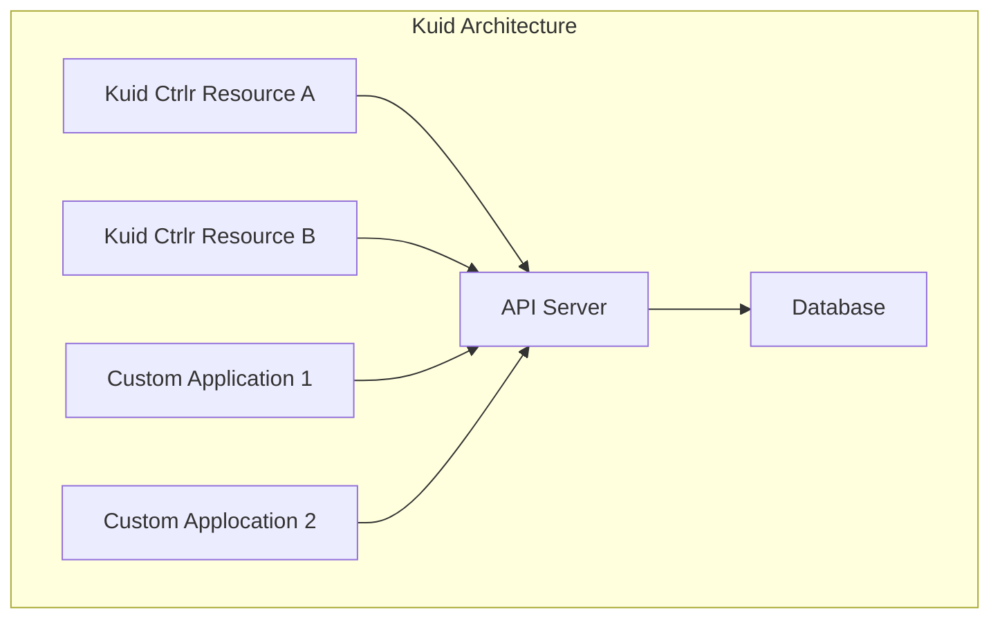

---
hide:
  - navigation
---

# Kuid (Kubernetes Identities)

---

`Kuid` is a cloud-native application that extends the Kubernetes API, dedicated to managing resources (inventory, IP, VLAN, AS, etc.) within your Kubernetes environments. By leveraging Kubernetes-native architecture and customizable fields, Kuid facilitates streamlined resource organization and tracking, offering notable features such as robust IP Address Management (IPAM) capabilities for efficient allocation and oversight of IP resources. Additionally, Kuid provides sophisticated infrastructure management functionalities, empowering users to organize and manage various infrastructure components within a structured hierarchy.

One of `Kuid's` standout features is its flexibility in resource management, allowing users to define resources statically or discover them dynamically. This dynamic discovery capability enables seamless integration with applications built on top of the Kuid API, empowering users to automate resource provisioning and management tasks effectively.

Moreover, `Kuid` introduces the concept of dynamic resource claiming based on selectors, enabling efficient resource allocation based on specific criteria. With these capabilities, Kuid provides a robust and flexible framework for managing resources effectively, whether in traditional or cloud-native environments. By offering comprehensive inventory management and precise resource identification, Kuid empowers users to optimize infrastructure operations and streamline resource provisioning workflows.

Leveraging Kubernetes-native architecture and customizable fields, Kuid serves as a cornerstone for automation. Seamlessly integrating into automation workflows, `Kuid` emerges as a key building block for driving efficiency and scalability in automating your infrastructure.

## Architecture

`Kuid` extends the Kubernetes API with dedicated resources, ensuring a tailored approach to managing infrastructure and identifiers within Kubernetes environments. Each resource is implemented as a dedicated API, offering specific parameters per resource and customizable key-value pairs to accommodate the diverse requirements of different environments. This flexibility allows users to define resource attributes according to their specific needs, ensuring seamless integration and adaptability across various environments.

To guarantee scalability and performance, every resource in `Kuid` is implemented as a microservice, enabling efficient scaling and resource utilization across distributed environments. This microservices architecture ensures that Kuid can handle large-scale deployments with ease while maintaining optimal performance levels.

Moreover, `Kuid's` architecture allows for seamless integration with different applications leveraging the event-driven API framework of Kubernetes. This capability empowers users to customize specific scenarios and workflows tailored to their unique requirements. Examples include applications for statically provisioning infrastructure resources for a Data Center Clos fabric or implementing a discovery app to validate if the desired state of `Kuid` resources matches the actual state of the environment.

By embracing a scalable and customizable architecture, Kuid offers users the flexibility and agility to meet the evolving demands of their infrastructure environments while ensuring efficient resource management and integration with existing workflows and toolchains.

## Features

With its comprehensive set of inventory resources and resource identifiers, Kuid empowers users to effectively manage and optimize their resources across diverse environments.

### Inventory Resources

Kuid provides a rich set of inventory resources designed to offer comprehensive visibility and management for physical, virtual, and containerized systems. These resources include:

- Region, Sites: Organize resources based on geographical regions and sites for efficient management and monitoring.
- Racks: Define and manage racks to facilitate the organization and placement of hardware components within data center environments.
- Nodes, Links, Endpoints: Capture and manage nodes, network links, and endpoints to ensure seamless connectivity and efficient resource utilization.
- ModuleBay, Module, Inventoryitem: Define and manage module bays and modules to facilitate modular hardware configurations and deployments.
- Cluster: Define and manage clusters to represent logical groupings of resources for efficient orchestration and management.

### Resource Identifiers

Kuid offers a robust set of resource identifiers to facilitate precise identification and allocation of resources within the environment. These identifiers include:

- IPAM: Manage IPv4 and IPv6 addresses with optional DNS plugin integration for CoreDNS, ensuring efficient IP address allocation and management.
- ASN: Allocate and manage Autonomous System Numbers (ASNs) to facilitate routing and networking operations.
- VLAN, VXLAN: Define and manage Virtual LANs (VLANs) and Virtual Extensible LANs (VXLANs) for network segmentation and isolation.
- Extended Communities: Define and manage extended communities to facilitate advanced routing and networking configurations.
- ESI: Manage Ethernet Segment Identifiers (ESIs) to support Ethernet VPN (EVPN) deployments and network virtualization.
- GeneralID: Define and manage GeneralIDs for versatile identification and allocation of resources.
- HashID: Generate and manage HashIDs for efficient and secure resource identification and allocation.

## Join us

Have questions, ideas, bug reports or just want to chat? Come join [our discord server](https://discord.gg/fH35bmcTU9).

